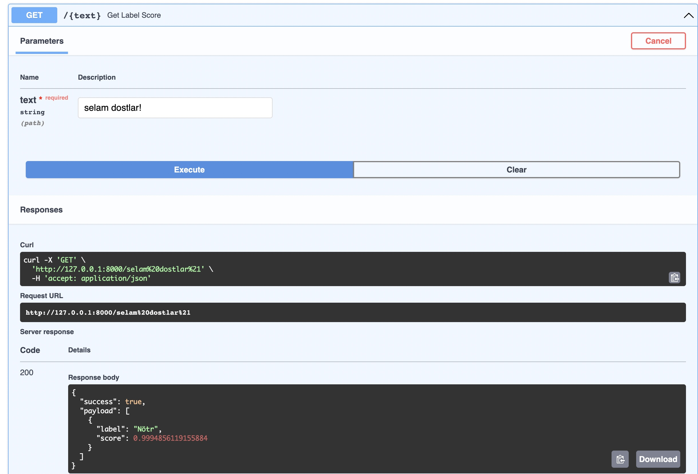

# turkish-bullying-api

**Türkçe Doğal Dil İşleme ile Sosyal Medya Zorbalığı Tespiti** için yapılmış bert tabanlı bir model servisidir.
- Lütfen FastAPI belgelerine bakın: https://fastapi.tiangolo.com/

## Model Hakkında 

---
language:
- tr
tags:
- translation
license: MIT
---

İnsanların sosyal medyada birbirlerine karşı kullandıkları zorbalık türlerini belirlemek için oluşturulmuş, dbmdz/bert-base-turkish-128k-cased tabanlı bir modeldir.
Dahil edilen sınıflar;

- Nötr
- Kızdırma/Hakaret
- Cinsiyetçilik
- Irkçılık

Modelin eğitiminde 3388 tweet kullanıldı. Buna göre eğitimde başarı oranları şu şekildedir;

|        | Cinsiyetçilik | Irkçılık | Kızdırma | Nötr | Accuracy |
| ------ | ------  | ------ | ------  | ------ | ------ |
| Precision | 0.884298 | 0.844037 | 0.910180 | 0.903571 | 892171 |
| Recall  | 0.891667 | 0.938776 | 0.835165 | 0.913357 | 892171 |
| F1 Score | 0.887967 | 0.888889 | 0.871060 | 0.908438 | 892171 |


# Ortam Oluşturma

Lütfen Python sürümünüzü '3.10' olarak ayarlayın.

Python versiyonunuzdan emin olmak için:

```bash
python3 --version
```

## Geliştirme Ortamını Ayarlama

- Virtual environment oluşturunuz.
```bash
    $ python -m venv <venv-name>
```
- Virtual environmentınızı aktive ediniz.
```bash
    $ source <venv-name>/bin/activate
```
- Kütüphaneleri Yükleyiniz.
```bash
    $ pip install -r requirements.txt
```


## Servisi Çalıştırma

```bash
    $ uvicorn main:app --reload
```
## Swagger Dökümanı

* Tarayıcıyı açın ve http://127.0.0.1:8000/docs veya http://127.0.0.1:8000/redoc adresine yönlendirin


## Örneğin

  
